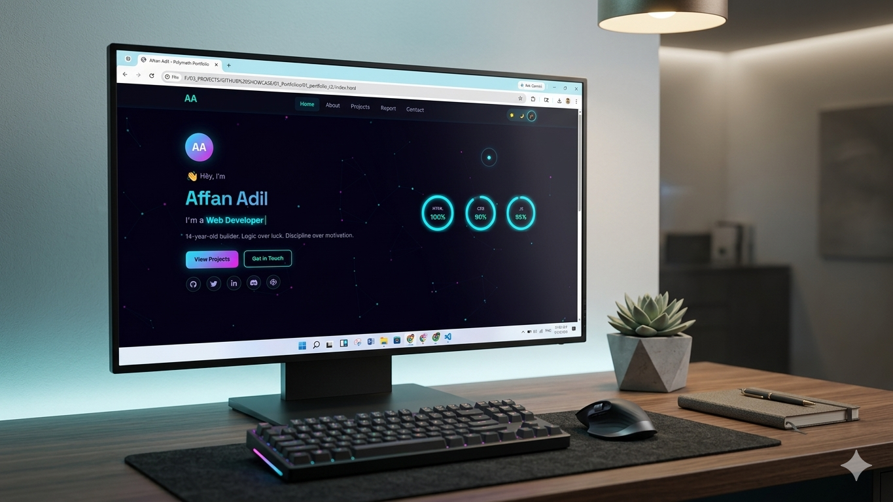
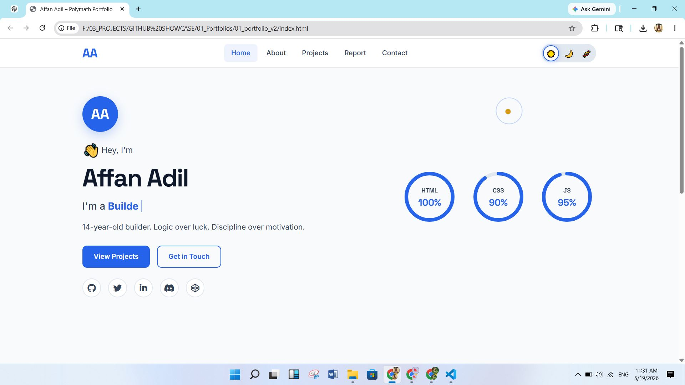
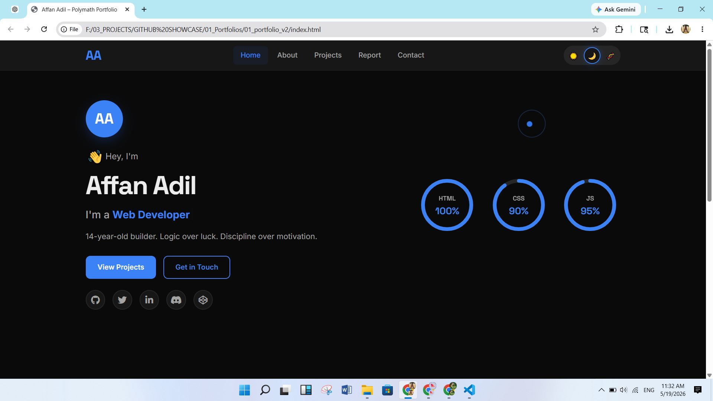
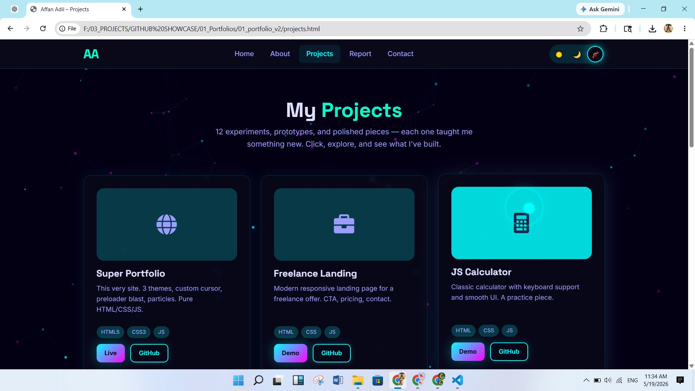
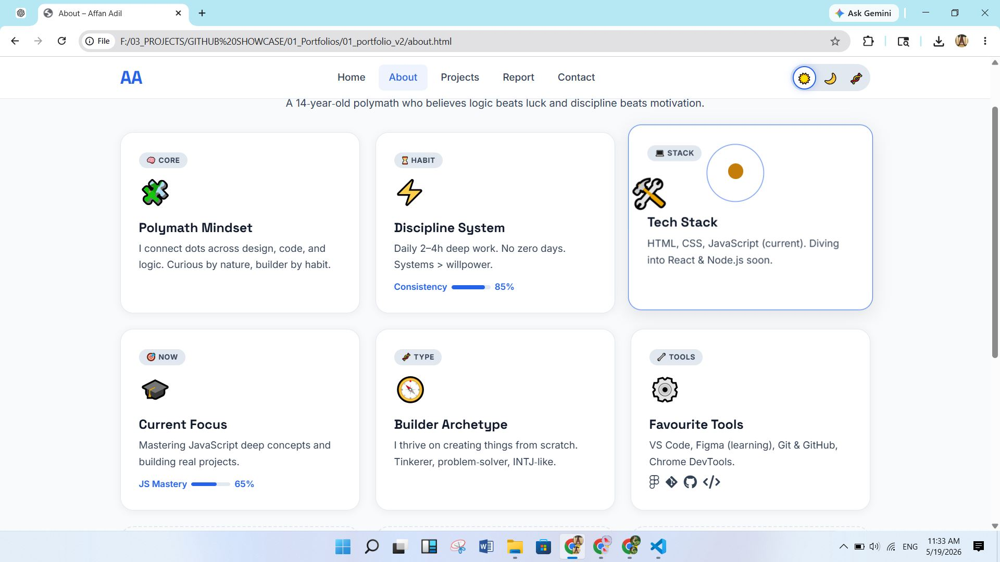
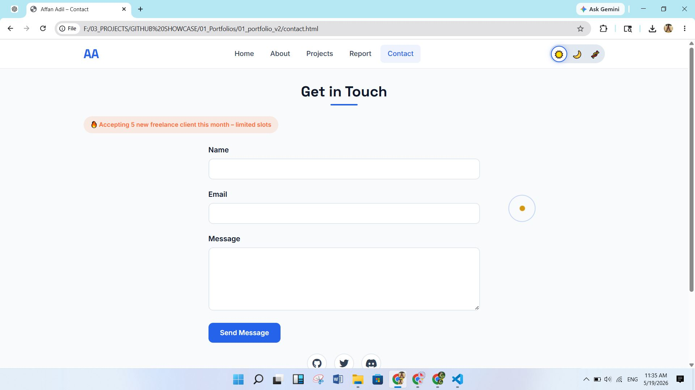
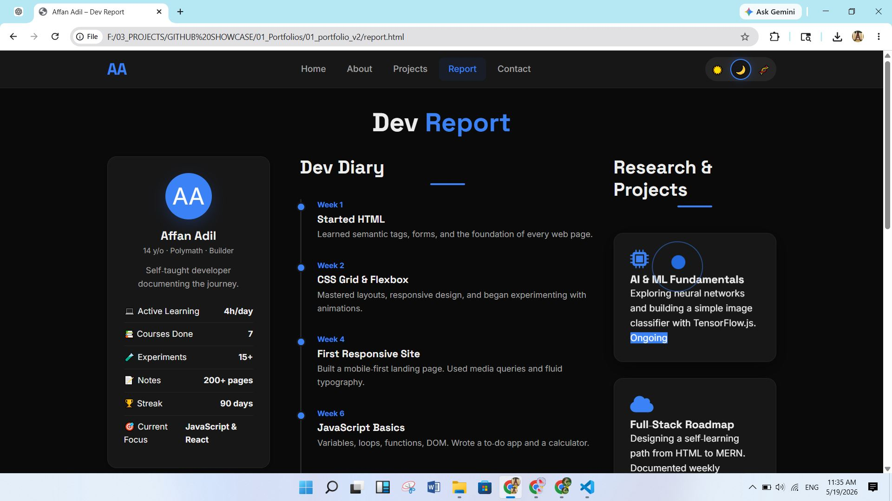
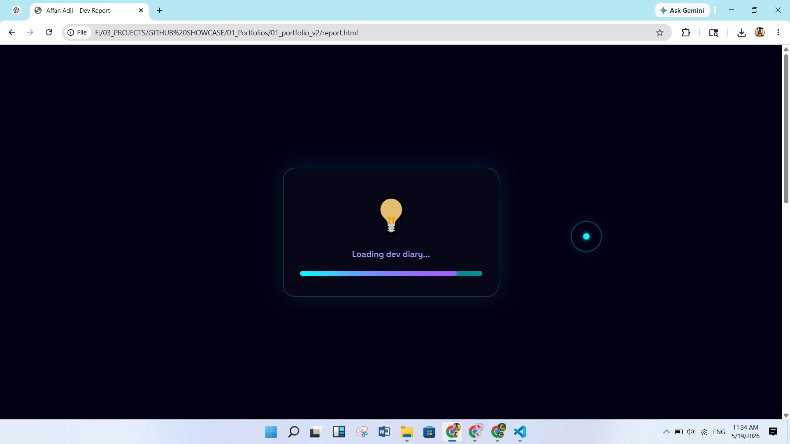

# 👋 Affan Adil

### Full-Stack Developer & Digital Polymath

*Logic over luck. Discipline over motivation.*

[Portfolio](https://affan675.github.io/01_portfolio_v2/projects.html) • [Wakatime](https://wakatime.com/@affan675) • [Email](mailto:affanadil119@gmail.com)

---

## 🚀 About Me

I'm a **14-year-old full-stack developer and builder** passionate about creating elegant, functional web experiences. I specialize in front-end development with a strong foundation in web standards, design systems, and modern tooling. My approach combines technical precision with creative problem-solving.

**What drives me:**
- Building products that matter
- Writing clean, maintainable code
- Exploring emerging technologies
- Teaching others what I've learned

---

## 💻 Tech Stack

### Languages & Frameworks

### Tools & Platforms

---

## 📈 GitHub Analytics

---

## 🎨 Featured Projects

### Portfolio v2
A modern, responsive personal portfolio website with theme switching, particle animations, and a comprehensive project showcase.
- **Stack:** HTML • CSS • JavaScript
- **Features:** Dark/Light theme, smooth animations, responsive design
- [View Repository](https://github.com/affan675/portfolio-v2)

---

## 🎪 Website Features

1. **Preloader** – Smooth loading animation before content appears
2. **Custom Cursor** – Interactive cursor design that responds to elements
3. **Tab Toggle** – Seamless visibility detection when switching tabs
4. **Custom Right-Click Menu** – Unique context menu experience
5. **Achievements** – Dynamic achievement system with visual display
6. **Click Sound Effects** – Auditory feedback for user interactions

---

## 📸 Screenshots

### Tech Desktop Frame

*Modern tech-inspired desktop mockup view*

### Home Page

*Clean, modern landing page with hero section*

### Dark Mode

*Seamless dark theme implementation*

### Projects Showcase

*Interactive project gallery with descriptions*

### About Section

*Detailed information and skills overview*

### Contact Section

*Easy connection and outreach options*

### Development Report

*Project metrics and development insights*

### Loader Animation

*Custom preloader animation*

---

## ✨ Key Skills

- **Frontend Development:** Responsive Design, CSS Animations, JavaScript DOM Manipulation
- **Web Standards:** Semantic HTML, Accessibility (a11y), SEO Optimization
- **Tools & Workflow:** Git/GitHub, VS Code, Browser DevTools
- **Problem Solving:** Algorithm Design, Data Structures, Debugging
- **Design:** UI/UX Principles, Design Systems, Color Theory

---

## 🎯 Current Focus

- Building more complex web applications
- Mastering frontend frameworks (React/Vue)
- Contributing to open-source projects
- Learning backend technologies

---

## 📧 Let's Connect

I'm always interested in collaborating on interesting projects or discussing web development best practices.

- **GitHub:** [@affan675](https://github.com/affan675)
- **Email:** [affanadil119@gmail.com](mailto:affanadil11@gmail.com)

---

### "Build things that matter. Code that lasts."

*Made with ❤️ by Affan Adil*

